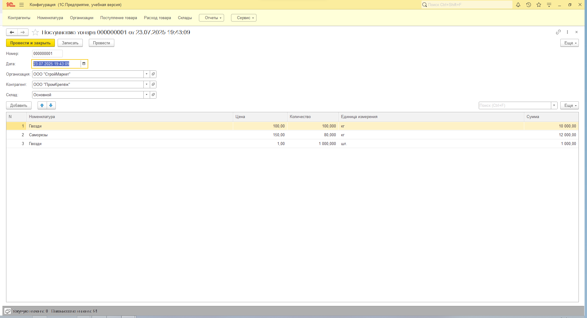
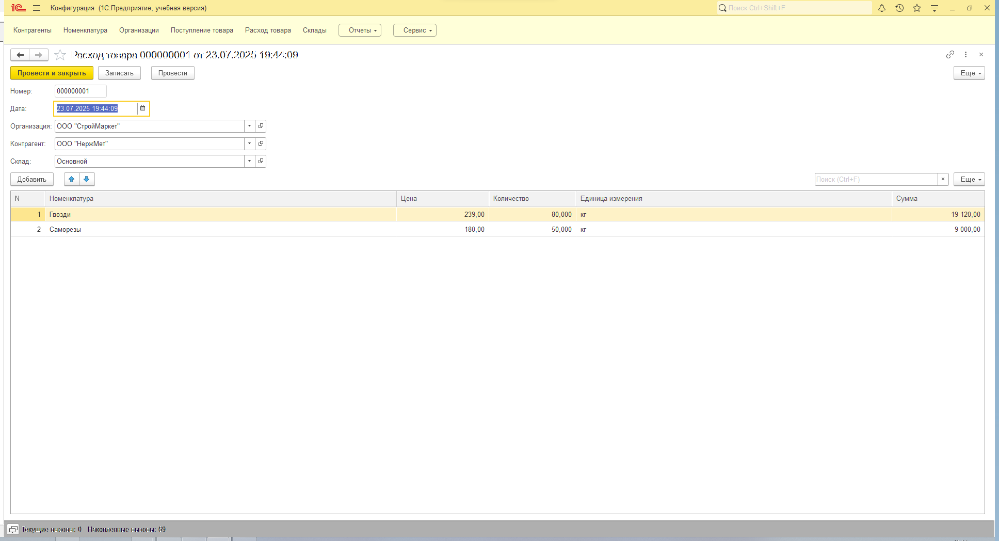
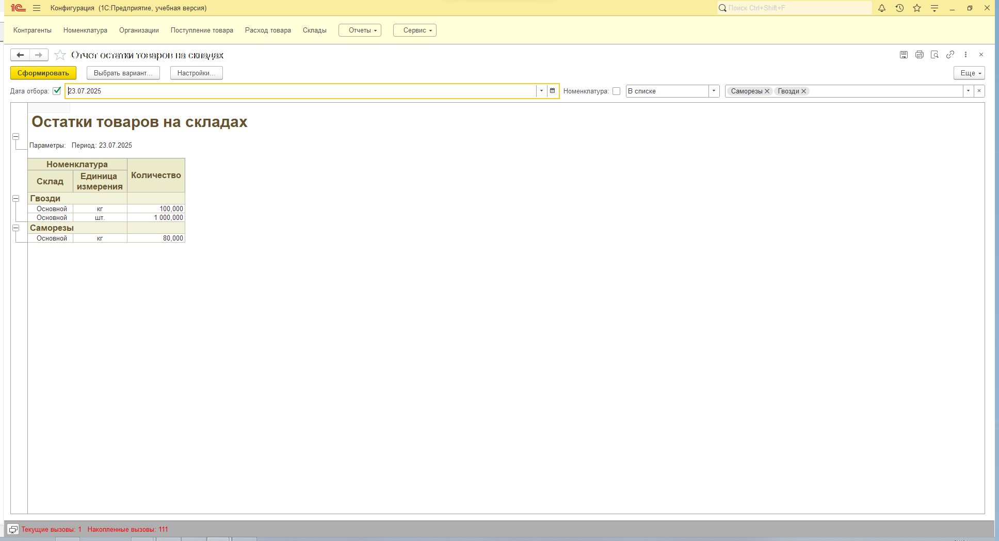
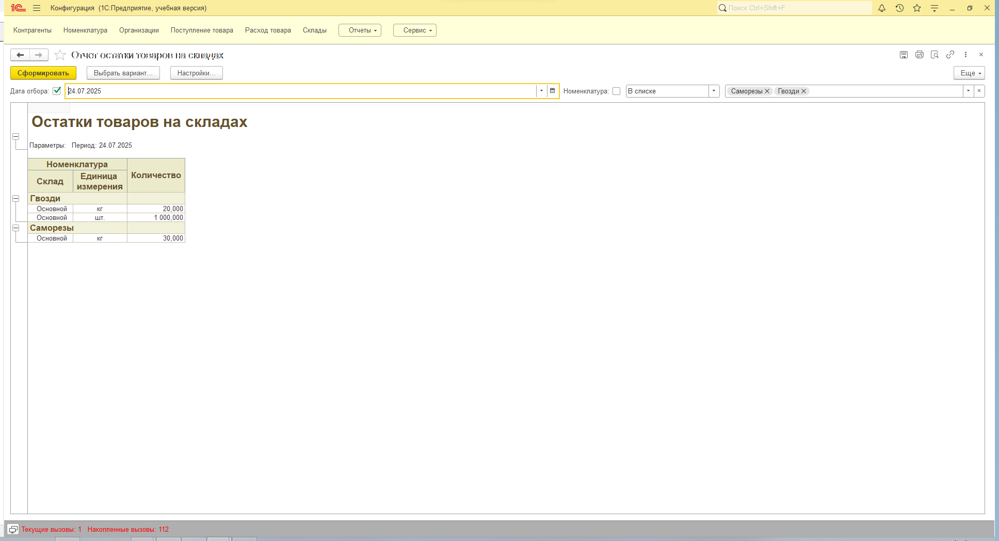
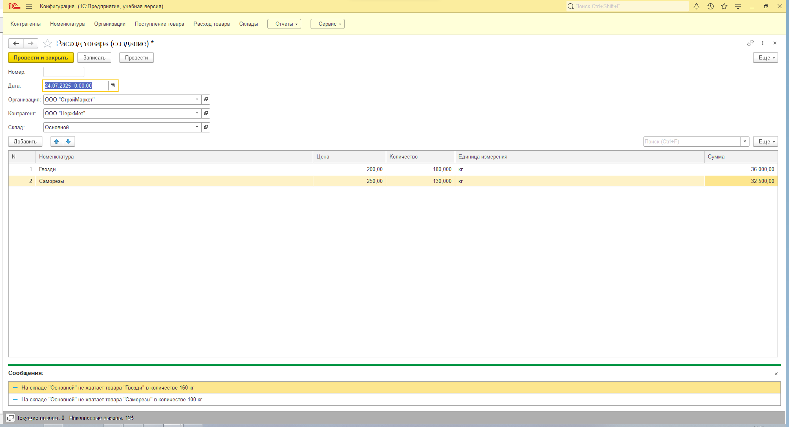

# Учёт товаров и отчёт остатков (документы и регистр)

## Описание задачи

Проект выполнен в рамках технического задания на собеседовании для позиции программиста-разработчика 1С. В пустой конфигурации реализована базовая логика движения товаров с контролем остатков и отчётностью.

### Исходные данные

* Платформа: 1С:Предприятие 8.3, версия 8.3.26
* Конфигурация: пустая

## Описание функционала

### Документы

Созданы два документа:

* **ПоступлениеТовара**
* **РасходТовара**

Оба документа содержат реквизиты:

* `Организация` (СправочникСсылка.Организации)
* `Контрагент` (СправочникСсылка.Контрагенты)
* `Склад` (СправочникСсылка.Склады)

**Табличная часть "Товары" включает поля:**

* `Номенклатура` (СправочникСсылка.Номенклатура)
* `Цена` (Число 15.2)
* `Количество` (Число 15.3)
* `Сумма` (Число 15.2, рассчитывается автоматически)

**Особенности:**

* Сумма пересчитывается при изменении количества или цены.
* При проведении документа "РасходТовара" реализован контроль остатков с использованием регистра накопления: если товаров на складе недостаточно — проведение запрещается.

### Регистр накопления

Создан **регистр накопления "ОстаткиТоваров"**, отражающий приход и расход товаров. Используется для:

* контроля остатков при расходе;
* построения отчёта по текущим остаткам на складе.

### Отчёт "Остатки товаров"

Реализован отчёт, отображающий:

* `Номенклатура`
* `Количество`
* `ЕдиницаИзмерения`

**Особенности отчёта:**

* Основан на регистре накопления.
* Показывает данные на **конец выбранной пользователем даты**.
* Имеет возможность **отбора по номенклатуре**.

## Структура репозитория

```
/1С-Projects/
  /УчетТоваров/
    /Скриншоты/              — интерфейс и визуальные элементы
    README.md                — описание проекта
    УчетТоваров.dt           — выгрузка конфигурации (база)
```

## Скриншоты



**Рисунок 1. Форма документа "Поступление товара"**



**Рисунок 2. Форма документа "Расход товара"**



**Рисунок 3. Отчёт по остаткам товаров до списания**



**Рисунок 4. Отчёт по остаткам товаров после списания**



**Рисунок 5. Сообщение об ошибке при нехватке остатков на складе**

## Как использовать

1. Создайте пустую ИБ в режиме конфигуратора 1С.
2. Загрузите файл конфигурации `УчетТоваров.dt`.
3. В пользовательском режиме:

   * Введите данные в документы "ПоступлениеТовара" и "РасходТовара".
   * Проверьте контроль остатков при расходе.
   * Постройте отчёт по остаткам на выбранную дату с фильтром по номенклатуре.

## Цель проекта

* Продемонстрировать умение работать с регистрами накопления.
* Реализовать автоматические вычисления и контроль остатков при движении товаров.
* Построить отчёт с параметрами отбора и расчётом данных на конец дня.
